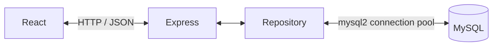

# Full-Stack Product Management System

使用 React、Express 與 MySQL 建立的商品管理系統，可管理商品名稱、價格與庫存。這個求職作品展示從前端表單、REST API、輸入驗證到資料庫持久化的完整開發流程。

目前已完成以 MySQL 為資料來源的 CRUD，提供本機操作；Login、JWT 與線上部署尚未完成。

## 已完成功能

- 商品列表：從 MySQL 取得商品，依 ID 升冪顯示。
- 新增商品：由 MySQL 產生 ID 與建立時間。
- 編輯商品：以 API 回傳資料更新畫面，相同內容再次儲存也可成功。
- 刪除商品：後端在 transaction 中查詢、鎖定並刪除商品。
- 資料持久化：重新整理頁面或重啟 Express 後，資料仍保留在 MySQL。
- Backend validation：驗證名稱、價格、庫存及更新／刪除的商品 ID。
- Frontend error handling：檢查 HTTP 狀態與網路錯誤；失敗時顯示訊息，保留表單與列表。

## 技術棧

| 層級 | 技術與用途 |
| --- | --- |
| Frontend | React、JavaScript、Vite、CSS；以 fetch 呼叫 API |
| Backend | Node.js、Express、REST API、cors |
| Database | MySQL、InnoDB、utf8mb4 |
| 資料存取 | Repository pattern、mysql2/promise connection pool、參數化 SQL |
| 設定與工具 | dotenv、npm、ESLint、Git／GitHub |

## 專案架構



React 負責表單與畫面狀態；Express 驗證輸入並回傳 HTTP response；Repository 集中處理 SQL，並將商品的 `id`、`price`、`stock` 統一轉為 number。路由遇到資料庫錯誤時回傳通用訊息，不回傳 SQL 或連線設定。

```text
fullstack-product-system/
├─ frontend/
│  ├─ src/
│  │  ├─ App.jsx                  # 商品表單、列表、CRUD 與錯誤提示
│  │  ├─ main.jsx                 # React 入口
│  │  └─ index.css                # 全域樣式
│  ├─ vite.config.js
│  └─ package.json
├─ backend/
│  ├─ server.js                   # Express 路由、輸入驗證與啟動
│  ├─ config/db.js                # MySQL connection pool
│  ├─ repositories/
│  │  └─ products.repository.js   # 商品 SQL 與回傳資料轉換
│  ├─ scripts/check-db.js         # SELECT 1 連線檢查
│  ├─ sql/001_create_products.sql # 建立 database 與 table
│  ├─ .env.example               # 環境變數範本
│  └─ package.json
└─ README.md
```

## REST API

Base URL：`http://localhost:3000`

| Method | Endpoint | 用途 | 成功回應 |
| --- | --- | --- | --- |
| GET | `/products` | 取得全部商品 | `200`，商品 array；無資料為 `[]` |
| POST | `/products` | 新增商品 | `201`，建立後的完整商品 |
| PUT | `/products/:id` | 更新商品 | `200`，更新後的完整商品 |
| DELETE | `/products/:id` | 刪除商品 | `200`，刪除前的完整商品 |

POST 與 PUT 都需要完整 JSON body，並設定 `Content-Type: application/json`：

```json
{
  "name": "機械鍵盤",
  "price": 2500,
  "stock": 10
}
```

商品回應範例（GET 將商品放在 array 中）：

```json
{
  "id": 1,
  "name": "機械鍵盤",
  "price": 2500,
  "stock": 10,
  "created_at": "2026-09-25T00:00:00.000Z"
}
```

`id` 與 `created_at` 由資料庫產生；PUT 不修改建立時間。

| 欄位 | Backend validation |
| --- | --- |
| name | 非空白 string，最多 255 個 Unicode 碼點 |
| price | finite number，0～99999999.99，最多兩位小數，不自動 round |
| stock | number 整數，0～4294967295 |
| 路徑 id | 十進位數字組成的正整數，須在 JavaScript 安全整數範圍內 |

路由驗證失敗回傳 `400`；PUT／DELETE 找不到商品回傳 `404`；資料庫操作失敗回傳 `500`。這些回應使用 `{ "message": "錯誤原因" }`。

## 本機設定與啟動

環境需求：

- Node.js 22.12+（22.x）或符合 Vite 8 要求的較新版本，以及 npm。
- 已啟動的 MySQL 8.0.16 或以上，以支援 schema 的 CHECK constraints。
- MySQL Workbench 或其他可執行 SQL 的工具。

以下以 Windows PowerShell 為例，從下載或 clone 後的專案根目錄開始。

### 1. 安裝前後端依賴

```powershell
cd backend
npm install
cd ../frontend
npm install
cd ..
```

### 2. 建立 MySQL schema

在 MySQL Workbench 連線至本機 MySQL（預設 `localhost:3306`），以具備建庫、建表權限的帳號開啟並執行 [001_create_products.sql](backend/sql/001_create_products.sql)。

SQL 會建立 `product_management` database 與 `products` table，使用 utf8mb4：

| 欄位 | 型別／用途 |
| --- | --- |
| id | INT UNSIGNED，AUTO_INCREMENT PRIMARY KEY |
| name | VARCHAR(255) NOT NULL，CHECK 排除純空白名稱 |
| price | DECIMAL(10,2) NOT NULL，CHECK 限制為非負值 |
| stock | INT UNSIGNED NOT NULL |
| created_at | TIMESTAMP DEFAULT CURRENT_TIMESTAMP |

腳本使用 `IF NOT EXISTS`，重複執行不清除資料，也不修改既有 table 結構。不會自動加入示範商品，首次啟動可從前端新增。

### 3. 設定環境變數

首次設定時，複製 [backend/.env.example](backend/.env.example)：

```powershell
Copy-Item backend/.env.example backend/.env
```

若已有 `.env`，直接編輯既有檔案，不要覆蓋。範本內容如下：

```dotenv
DB_HOST=127.0.0.1
DB_PORT=3306
DB_USER=root
DB_PASSWORD=
DB_NAME=product_management
```

依本機設定調整 host、port、user、database，並自行在 `DB_PASSWORD` 填入密碼。`.env` 已由 backend 的 `.gitignore` 排除，不應提交 Git；範本不包含真實密碼。公開部署前應改用專用的資料庫帳號。

### 4. 檢查連線並啟動後端

第一個終端機，從專案根目錄執行：

```powershell
cd backend
npm run db:check
node server.js
```

連線檢查成功後再啟動後端。API 位址為 `http://localhost:3000`；目前後端沒有 `npm start` script。

### 5. 啟動前端

第二個終端機，從專案根目錄執行：

```powershell
cd frontend
npm run dev
```

開啟 Vite 終端輸出的 Local URL。前端目前固定呼叫 `http://localhost:3000`，需同時保持 Express 與 MySQL 運行。

### 6. 確認運作

在前端新增、編輯、刪除測試商品；重新整理及重啟後端後，確認結果仍保留。也可開啟 `http://localhost:3000/products` 檢查 JSON 列表。

前端另提供 `npm run lint` 與 `npm run build`。目前尚未建立完整自動化測試套件，`db:check` 僅驗證資料庫連線。

## 未來規劃（尚未完成）

- [ ] Login 與使用者帳號管理
- [ ] JWT 身分驗證與 API 存取控制
- [ ] 商品搜尋
- [ ] 商品列表分頁
- [ ] Deployment：前後端與資料庫部署、環境設定及線上展示網址
